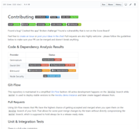

#  OWASP GitHub Template  

_{{**TODO:** Add other crucial overall status badges here. Context specific badges should go next to their section title or into [CONTRIBUTING.md](CONTRIBUTING.md).}}_

_{{**TODO:** Replace above  badge with one of the following if applicable and delete this paragraph:}}_
* 
* 

_{{**TODO:** Add brief project description (3-5 lines) here.}}_

For a detailed introduction, full list of features and technical
overview please visit the official project page:
<https://www.owasp.org/index.php/OWASP_GitHub_Template_Project>

## Setup

_{{**TODO:** Add instructions how to install and run the tool or how to integrate it into other software. If there are different options (e.g. cloning from GitHub & running a Docker container) explain each in their own sub-section.}}_

## Usage

_{{**TODO:** Add instructions how to perform the typical use cases of the tool or library.}}_

## Additional Documentation

_{{**TODO:** Add links to further documentation in this section. This can be a printed book, [GitBook](https://www.gitbook.com/@owasp), powerpoint slides, screencasts etc.}}_

## Troubleshooting 

If you need help with the setup please check the
[TROUBLESHOOTING.md](TROUBLESHOOTING.md) or post your specific problem
or question in the
[official Gitter Chat](https://gitter.im/owasp/github-template).

## Contributing  

Found a bug? Crashed the tool? Propose a new feature?

Feel free to
[create an issue](https://github.com/owasp/github-template/issues) or
[post your ideas in the chat](https://gitter.im/owasp/github-template)!
Pull requests are also highly welcome - please refer to
[CONTRIBUTING.md](CONTRIBUTING.md) for details.

## References

Did you write a blog post, magazine article or do a podcast about or
mentioning OWASP GitHub Template? Or maybe you held or joined a conference
talk or meetup session, a hacking workshop or public training where this
project was mentioned?

Add it to our ever-growing list of [REFERENCES.md](REFERENCES.md) by
forking and opening a Pull Request!

## Donations

### PayPal 

PayPal donations via above button go to the OWASP Foundations and are
earmarked for "GitHub Template". This is the preferred way to support the
project.

_{{**TODO:** Add alternative ways to donate to the project financially here, e.g. BitCoin address or other micropayment provider links.}}_

## Credits

_{{**TODO:** Add "special thanks to..."-like credits here. Please **do not add sponsors** here! These belong into the ["Acknowledgements" tab of your OWASP Project wiki page](https://www.owasp.org/index.php/OWASP_Juice_Shop_Project#tab=Acknowledgements) exclusively!}}_

## Contributors

_{{**TODO:** You can generate a list of contributors via various open source tools, e.g. `node-authors`}}_

Ordered by date of first contribution.
[Auto-generated](https://github.com/dtrejo/node-authors) on Tue, 06 Jun
2017 00:00:00 GMT.

- [Björn Kimminich](https://github.com/bkimminich) aka `bkimminich`

## Licensing  

This program is free software: you can redistribute it and/or modify it
under the terms of the [MIT license](LICENSE). OWASP GitHub Template and any
contributions are Copyright © by Bjoern Kimminich 2017.

_{{**TODO:** Replace above text and the contents of the [LICENSE file](LICENSE) with [your chosen open-source license](https://opensource.org/licenses).}}_

